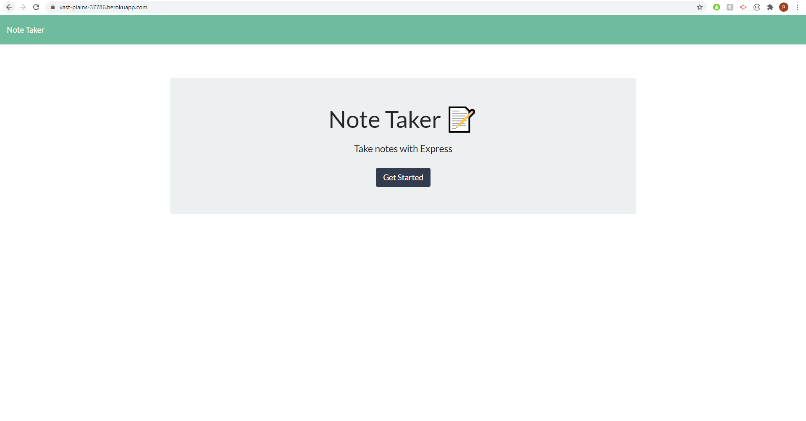
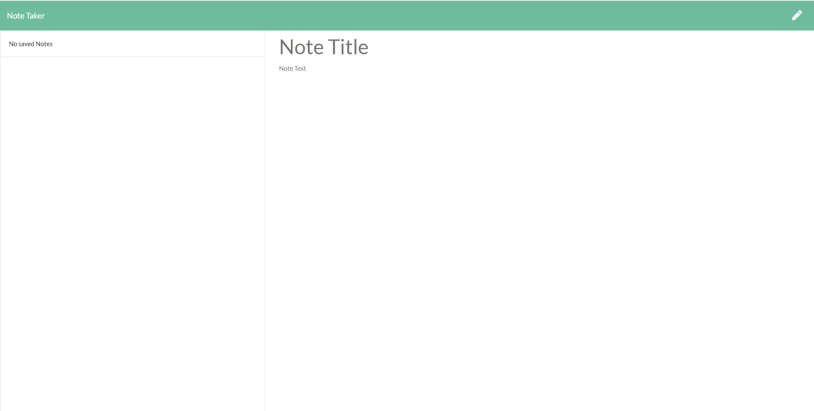
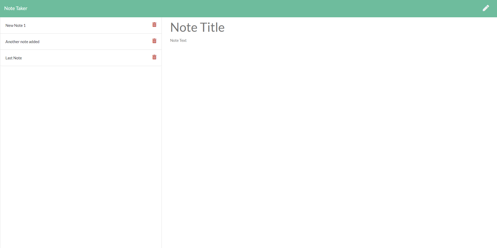
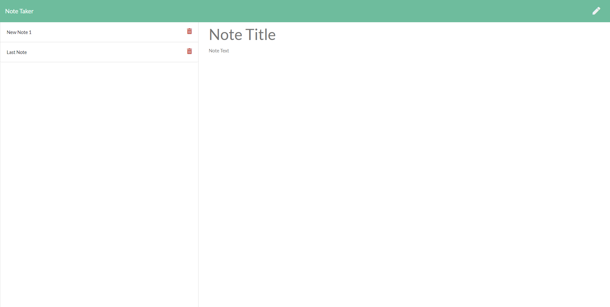
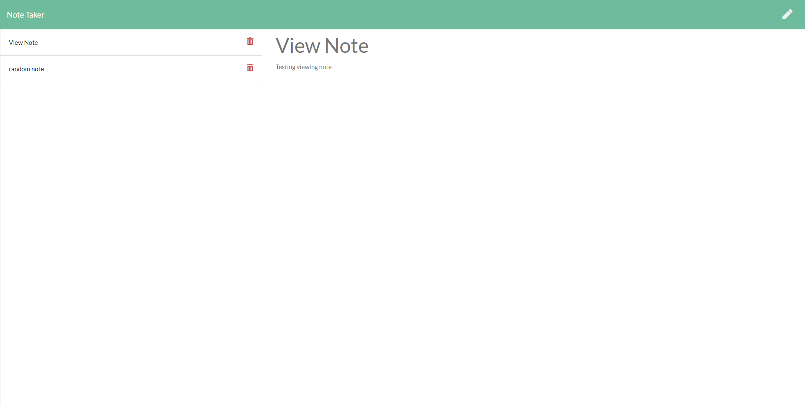

# Unit 11 Express Homework: Note Taker

An application is developed to write, save, and delete notes for a user. The user can create a note, save a note, view previous notes and delete notes.

Here is the link to the URL of the application. https://vast-plains-37786.herokuapp.com/

Here is the link to the Github repository. https://github.com/phakpa/noteTaker

images below ------------------------------------------------------------------------------

